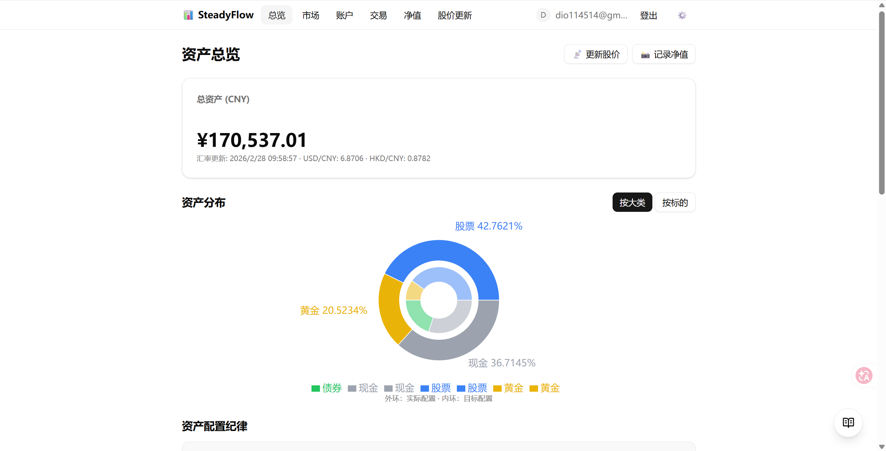
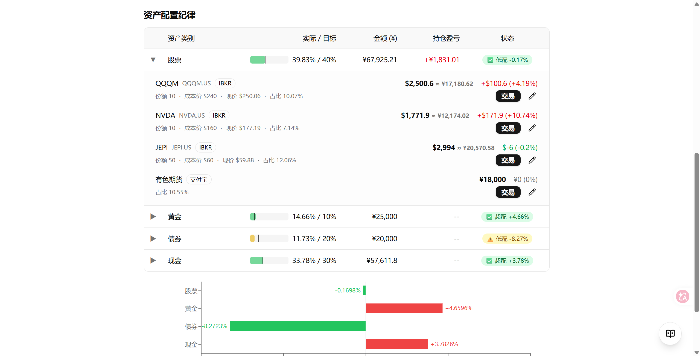
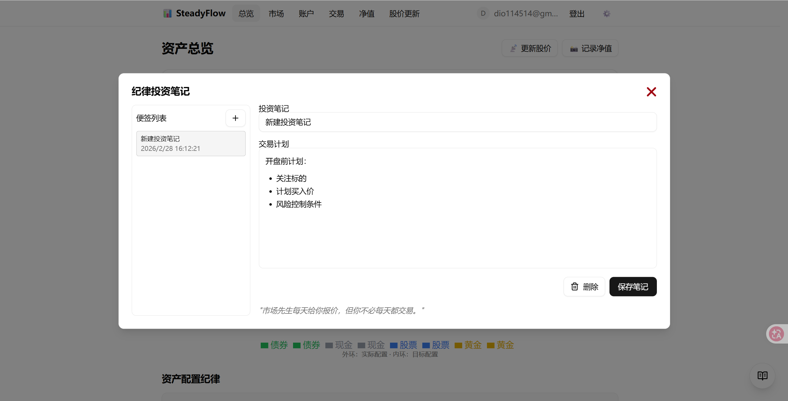
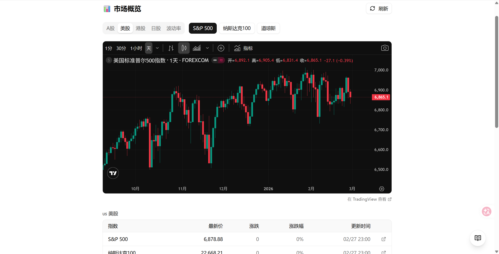
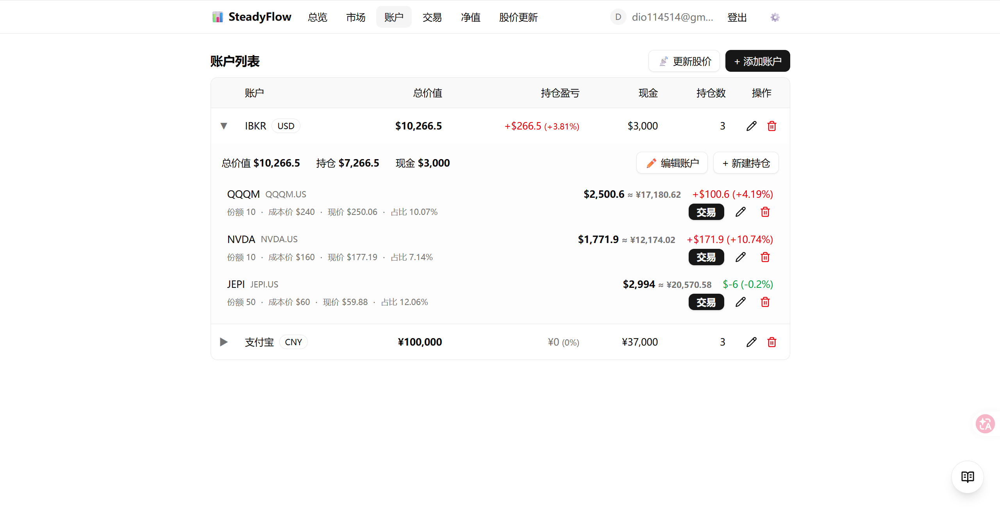

# InvestManage

个人投资组合管理 Web 应用，用于替代 Excel 管理多平台资产（A 股/美股/港股券商、银行、支付宝等），并提供仓位管理、交易记录、净值跟踪与投资纪律支持。

## 项目简介

InvestManage 目标是提供一个轻量、可自托管、可多用户的投资管理系统：

- 统一管理多账户与多币种资产
- 记录交易并自动更新现金/持仓
- 查看资产配置偏离与再平衡建议
- 跟踪每日净值变化与图表
- 提供投资纪律笔记与持仓备注
- 支持本地 SQLite 与云端 Neon PostgreSQL 双数据库模式

## 核心功能

- 账户管理：现金余额、持仓列表、账户维度盈亏
- 交易系统：买入/卖出/分红/出入金，支持副作用开关
- 资产配置：目标比例、当前比例、偏离度可视化
- 净值历史：按日记录总资产净值并展示趋势（资产变动自动刷新 + 每日自动记录）
- 市场概览：主要指数行情 + TradingView 图表
- 用户系统：邮箱密码登录、GitHub OAuth、管理员后台

## 技术栈

- Next.js 16 + React 19 + TypeScript
- Tailwind CSS 4 + shadcn/ui
- Drizzle ORM
- SQLite (`better-sqlite3`) / PostgreSQL (Neon serverless)
- Auth.js v5 (`next-auth@beta`) + bcryptjs

## 部分界面展示







## 快速开始（本地开发，SQLite）

### 1. 环境准备

- Node.js 20+
- npm 10+

### 2. 安装依赖

```bash
npm install
```

### 3. 配置环境变量

复制 `.env.example` 为 `.env`，至少配置：

```env
DB_TYPE=sqlite
AUTH_SECRET=your-auth-secret
AUTH_URL=http://localhost:3000
CRON_SECRET=your-cron-secret
GITHUB_ID=your-github-client-id
GITHUB_SECRET=your-github-client-secret
DEFAULT_ADMIN_EMAIL=admin@example.com
DEFAULT_ADMIN_PASSWORD=change-me-123456
```

### 4. 启动开发服务

```bash
npm run dev
```

访问：`http://localhost:3000`

说明：

- 应用启动时会自动执行 Drizzle migrate（`drizzle/`）并初始化基础汇率数据。
- 首次可通过 `/register` 注册用户后登录使用。

## 部署指南

### 方案 A：Vercel + Neon PostgreSQL（推荐）

### 1. 准备 Neon 数据库

在 Neon 创建数据库并获取 `DATABASE_URL`（建议 serverless 连接串）。

### 2. 配置 Vercel 环境变量

可参考 `.env.vercel.example`，至少需要：

```env
DB_TYPE=postgres
DATABASE_URL=postgresql://...
AUTH_SECRET=your-production-secret
AUTH_URL=https://your-app.vercel.app or https://localhost:3000
CRON_SECRET=your-cron-secret
# Github OAuth登录（可选项）
GITHUB_ID=your-github-client-id
GITHUB_SECRET=your-github-client-secret
```

### 3. 配置 GitHub OAuth 回调地址

在 GitHub OAuth App 中设置：

- 本地：`http://localhost:3000/api/auth/callback/github`
- 生产：`https://your-app.vercel.app/api/auth/callback/github`

详细步骤见 `docs/github-oauth-setup.md`。

### 4. 部署

1. 将仓库导入 Vercel
2. 在 Vercel 项目中导入环境变量
3. 触发部署

说明：

- 运行时会自动尝试执行 PostgreSQL 迁移（`drizzle-pg/`）并做 seed 兜底。
- 生产环境建议在发布前手动执行一次 `npm run db:migrate:pg` 做显式迁移控制。

### 净值自动记录定时任务

- 云端（Vercel）：根目录 `vercel.json` 已配置每天触发一次 `POST /api/cron/netvalue`（兼容 Hobby 免费计划）。
- 调度逻辑：Cron 对每个用户执行“先更新股价、后写入当日净值”，并以 `(userId + date)` 幂等 upsert。
- 宽松模式：股价同步结果无论是 `ok` / `partial` / `failed`，都继续写入净值；响应中包含每用户 `quoteSyncStatus` 与失败摘要，便于排障。
- 分批与预算：支持按批处理用户并基于时间预算提前停止，避免函数被平台强杀。可通过环境变量调优：
  - `CRON_NETVALUE_BATCH_SIZE`（默认 `25`）
  - `CRON_NETVALUE_TIME_BUDGET_MS`（默认 `50000`）
  - `CRON_NETVALUE_SAFE_REMAINING_MS`（默认 `6000`）
- 续跑补偿：Cron 会在 `settings` 保存游标 `cron.netvalue.cursor`，下次从上次中断位置继续；到用户列表末尾后自动重置到起点循环覆盖。
- 鉴权：请求需携带 `CRON_SECRET`（`Authorization: Bearer <CRON_SECRET>` 或 `x-cron-secret`）。
- 本地离线：可用系统计划任务（Windows Task Scheduler / cron）每天调用一次该接口，行为与云端一致。

### 方案 B：Windows 离线分发包

适用于本地给非开发用户分发可双击启动版本。

### 1. 本地打包

```bash
node scripts/package.js
```

### 2. 产物位置

- `dist/InvestManage.zip`
- 解压后双击 `启动.bat` 启动

说明：

- 打包脚本会自动 `next build`、组装 standalone 产物并嵌入 `node.exe`。
- 启动脚本会自动寻找可用端口并打开浏览器。

### 方案 C：自托管 Node.js（服务器）

```bash
npm install
npm run build
npm run start
```

根据部署环境设置 `.env`：

- `DB_TYPE=sqlite`：使用本地 `data/invest.db`
- `DB_TYPE=postgres`：使用 `DATABASE_URL` 连接 PostgreSQL

## 数据库迁移与运维

- SQLite 配置：`drizzle.config.ts`
- PostgreSQL 配置：`drizzle.config.pg.ts`
- 详细流程与排障：`docs/drizzle-operations-guide.md`

常用命令：

```bash
# PostgreSQL 生成迁移
npm run db:generate:pg

# PostgreSQL 执行迁移
npm run db:migrate:pg

# 类型检查
npm run typecheck
```

## 项目结构（简版）

```text
src/
  app/          # 页面与 API 路由
  components/   # UI 与业务组件
  db/           # schema、连接、seed
  lib/          # 认证、工具函数、数据服务
docs/           # 运维与设计文档
openspec/       # 需求与变更规格
```

## 相关文档

- `project_overview.md`：项目核心状态与协作日志
- `docs/drizzle-operations-guide.md`：数据库迁移操作手册
- `docs/github-oauth-setup.md`：GitHub OAuth 配置
- `openspec/specs/`：模块规格文档
